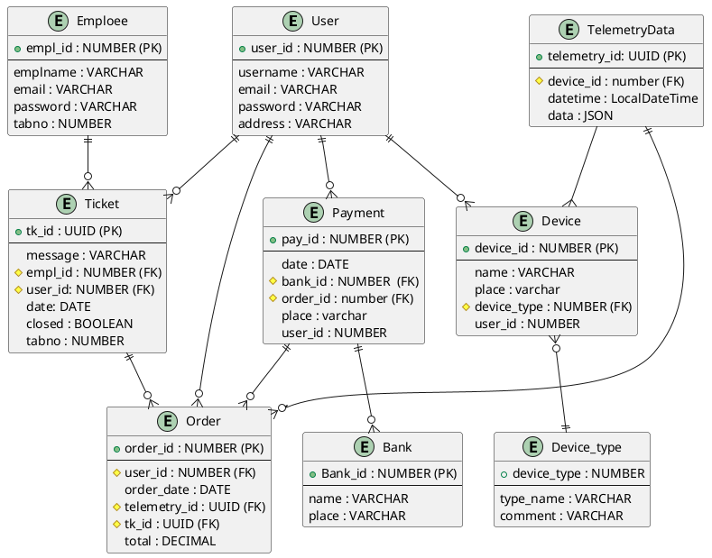

```puml
@startuml

entity "User" {
  + user_id : NUMBER (PK)
  --
  username : VARCHAR
  email : VARCHAR
  password : VARCHAR
  address : VARCHAR
}

entity "Emploee" {
  + empl_id : NUMBER (PK)
  --
  emplname : VARCHAR
  email : VARCHAR
  password : VARCHAR
  tabno : NUMBER
}

entity "Ticket" {
  + tk_id : UUID (PK)
  --
  message : VARCHAR
  # empl_id : NUMBER (FK)
  # user_id: NUMBER (FK)
  date: DATE
  closed : BOOLEAN
  tabno : NUMBER
}

entity "TelemetryData" {
  + telemetry_id: UUID (PK)
  --
  # device_id : number (FK)
  datetime : LocalDateTime
  data : JSON
}

entity "Device" {
  + device_id : NUMBER (PK)
  --
  name : VARCHAR
  place : varchar
  # device_type : NUMBER (FK)
  user_id : NUMBER
}

entity "Order" {
  + order_id : NUMBER (PK)
  --
  # user_id : NUMBER (FK)
  order_date : DATE
  # telemetry_id : UUID (FK)
  # tk_id : UUID (FK)
  total : DECIMAL
}

entity "Device_type" {
  + device_type : NUMBER
  --
  type_name : VARCHAR
  comment : VARCHAR
}

entity "Payment" {
  + pay_id : NUMBER (PK)
  --
  date : DATE
  # bank_id : NUMBER  (FK)
  # order_id : number (FK) 
  place : varchar
  user_id : NUMBER
}

entity "Bank" {
  + Bank_id : NUMBER (PK)
  --
  name : VARCHAR
  place : VARCHAR
}


User ||--o{ Order
User ||--o{ Device
User ||--o{ Payment
User ||--o{ Ticket
Emploee ||--o{ Ticket
Payment ||--o{ Bank
TelemetryData ||--o{ Order
Ticket ||--o{ Order
Payment ||--o{ Order
TelemetryData --{ Device
Device }o--|| Device_type

@enduml 
```